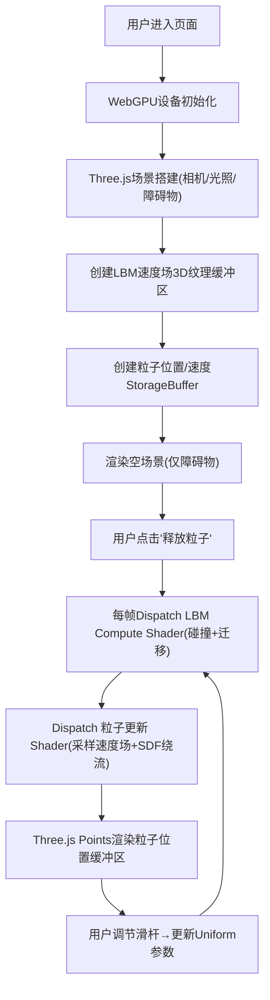

## 1. 产品概述
基于WebGPU Compute Shader的3D实时流体粒子模拟演示系统，利用格子玻尔兹曼方法(LBM)在GPU上求解纳维-斯托克斯方程，实现粒子绕过旋转障碍物的真实绕流效果。

- **核心目的**：展示WebGPU通用计算能力与3D图形渲染结合的技术方案，提供高交互性的流体物理可视化
- **目标用户**：前端开发者、计算机图形学爱好者、Web技术演示场景
- **产品价值**：验证纯GPU端到端物理模拟+渲染管线的可行性，所有粒子物理计算(数千量级)完全卸载至GPU，CPU仅负责参数传递

---

## 2. 核心功能

### 2.1 功能模块
1. **主场景页面**：3D流体模拟视口 + 控制面板
2. **流体物理引擎(WebGPU)**：LBM 3D格子玻尔兹曼求解器、粒子运动积分、障碍物SDF碰撞
3. **渲染层(Three.js)**：障碍物网格渲染、PointsMaterial粒子渲染、场景光照与相机
4. **交互控制层**：释放粒子按钮、参数调节滑杆、障碍物形状切换

### 2.2 页面详情
| 页面名称 | 模块名称 | 功能描述 |
|-----------|-------------|---------------------|
| 主模拟页面 | 3D视口 | 全屏Canvas渲染3D流体场景，支持鼠标拖拽旋转视角 |
| 主模拟页面 | 控制面板 | 悬浮式控制面板，包含释放粒子按钮、参数滑杆、障碍物切换 |
| 主模拟页面 | 障碍物 | 居中悬浮旋转的3D障碍物(球体/圆环体)，半透明金属质感 |
| 主模拟页面 | 粒子系统 | 从场景边缘6个面持续喷射粒子，受速度场驱动产生绕流效果 |
| 主模拟页面 | HUD信息 | 左上角显示FPS、粒子数量、GPU格子数等实时统计数据 |

---

## 3. 核心流程

用户进入页面 → WebGPU/Three.js自动初始化 → 障碍物渲染并自转 → 显示初始空场景 → 用户点击"释放粒子" → Compute Shader启动LBM流体求解 → 粒子从边缘喷射 → 粒子被速度场驱动绕过障碍物 → 用户调节参数实时反馈

---

## 4. 用户界面设计

### 4.1 设计风格
- **主色调**：深空蓝黑 `#0a0e1a` 为底，流体粒子采用青色 `#00e5ff` → 紫色 `#7c4dff` 渐变色
- **点缀色**：障碍物使用玫瑰金 `#e8b4b8` 半透明金属质感
- **按钮风格**：玻璃拟态(Glassmorphism)，毛玻璃背景 + 细边 + 发光悬浮效果
- **字体**：标题使用 `JetBrains Mono` 等宽字体，正文使用系统默认无衬线
- **布局风格**：全屏沉浸式Canvas + 左上角HUD + 右上角控制面板

### 4.2 页面设计概述
| 页面名称 | 模块名称 | UI元素 |
|-----------|-------------|-------------|
| 主页面 | 3D视口 | 全屏、深空渐变背景、轻微雾气、点光源两盏 |
| 主页面 | HUD面板 | 左上角，半透明黑色圆角卡片，JetBrains Mono字体，FPS/粒子数/格子数三行数据 |
| 主页面 | 控制面板 | 右上角悬浮卡片，玻璃拟态，竖向排列：释放粒子大按钮 + 粘度滑杆 + 喷射强度滑杆 + 障碍物形状下拉 |
| 主页面 | 障碍物 | 居中，半径约场景1/6，半透明PBR材质，沿Y轴缓慢自转(60°/s) |
| 主页面 | 粒子 | PointsMaterial，大小约3px，颜色按速度模长映射青紫渐变，Additive混合 |

### 4.3 响应式
- **桌面端优先**：控制面板固定右上角(280px宽)，HUD固定左上角
- **平板**：控制面板缩小至240px，字体缩放0.9倍
- **移动端**：控制面板改为底部抽屉式，点击展开/收起

### 4.4 3D场景指引
- **环境**：纯深色背景 + 指数雾(近黑)，无HDRI，保持科技感
- **光照**：两盏PointLight(左上冷白+右下暖紫) + AmbientLight(0.15)
- **相机**：PerspectiveCamera(fov=55)，初始位置(0, 2.5, 7)，OrbitControls环绕观察
- **障碍物动画**：绕Y轴匀速旋转，速度可通过滑杆调节(默认60°/s)
- **后处理**：轻微Bloom(强度0.6)，让粒子发光；无其他后处理以保证性能
- **性能预算**：粒子数默认8000(上限16000)，LBM网格64³减半至32×32×32以平衡精度与速度
