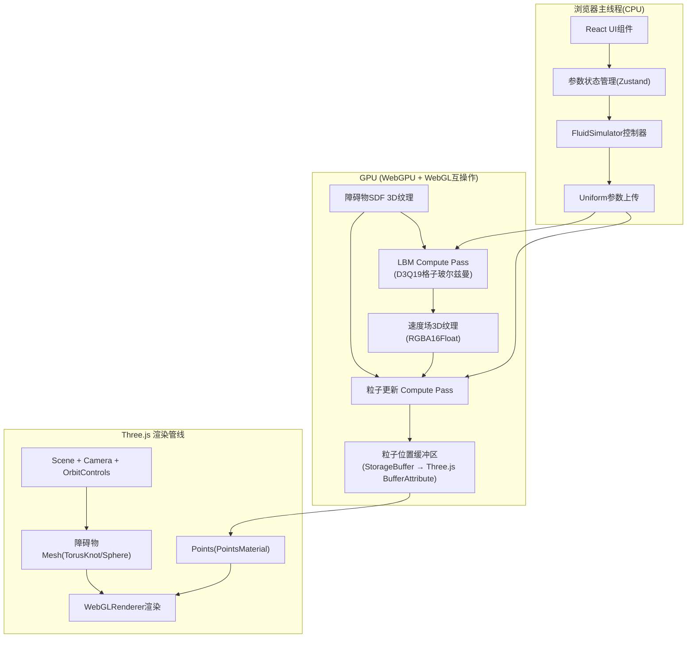

## 1. 架构设计



**核心设计思路**：WebGPU负责全部物理计算(LBM求解+粒子积分)，通过`GPUBuffer`与Three.js共享顶点缓冲区(使用`importExternalTexture`或同上下文方案)，CPU仅每帧上传Uniform参数(时间、粘度、喷射开关等)，零粒子数据回读。

---

## 2. 技术描述

- **前端框架**：React@18 + TypeScript + Vite@5
- **样式方案**：TailwindCSS@3 + CSS自定义属性(主题色变量)
- **状态管理**：Zustand(轻量存储UI参数：粘度、喷射强度、障碍物类型等)
- **3D渲染**：Three.js@0.160 + @react-three/fiber@8 + @react-three/drei@9(OrbitControls/Stats) + @react-three/postprocessing@2(Bloom)
- **GPU计算**：原生WebGPU API(无第三方封装)，WGSL着色器
- **数据互操作**：WebGPU与WebGL2同`GPUDevice`上下文，通过`GPUBuffer`的`CopyExternalTextureToTexture`或直接映射BufferAttribute的`buffer`实现零拷贝共享

---

## 3. 路由定义

| 路由 | 用途 |
|-------|---------|
| `/` | 主模拟页面(唯一页面) |

---

## 4. 核心数据结构(TS类型)

```typescript
// 全局参数状态(Zustand)
interface SimParams {
  isEmitting: boolean;          // 是否喷射粒子
  viscosity: number;            // 粘度系数(0.001 ~ 0.05)
  emitRate: number;             // 每秒喷射粒子数
  obstacleType: 'sphere' | 'torus' | 'torusKnot';
  obstacleRotationSpeed: number;// 障碍物自转速度(度/秒)
  particleCount: number;        // 最大粒子数
}

// LBM Uniform结构体(与WGSL对应)
interface LBMUniforms {
  deltaTime: f32;
  viscosity: f32;
  gridSize: vec3u;              // 32,32,32
  invGridSize: vec3f;
  obstacleCenter: vec3f;
  obstacleRadius: f32;
  obstacleType: u32;            // 0=球 1=环 2=环结
  obstacleRotation: mat3x3f;    // 当前旋转矩阵(用于SDF)
  emitMask: u32;                // 哪几个面喷射(bitmask)
  time: f32;
}

// 粒子数据结构(StorageBuffer, SoA布局)
// Buffer1: position (x,y,z,life)  x vec4<float>
// Buffer2: velocity (vx,vy,vz,seed) x vec4<float>
```

---

## 5. WebGPU Compute Shader 设计

### 5.1 LBM Solver (D3Q7简化模型，3D)
- **工作项**：`workgroup_size=(4,4,4)`，覆盖32³=32768格
- **双缓冲**：2个3D纹理(`velocityA`/`velocityB` + `densityA`/`densityB`)Ping-Pong
- **Pass1 - 碰撞步**：对每个格子读取19个方向分布函数，执行BGK碰撞算子
- **Pass2 - 迁移步**：沿速度方向将分布函数迁移至相邻格，边界处反弹
- **障碍物处理**：采样预计算的SDF 3D纹理，在障碍格内执行"反弹边界条件"(bounce-back)实现绕流

### 5.2 粒子更新 Shader
- **工作项**：`workgroup_size=(256,1,1)`，覆盖8000粒子=32工作组
- **步骤**：
  1. 粒子位置归一化至[0,1]³，`textureSampleLevel`采样3D速度场
  2. 采样障碍物SDF，若距离<阈值则沿SDF梯度推出(penalty force) + 速度投影至切平面
  3. 半隐式欧拉积分：`v += a*dt; p += v*dt`
  4. 若life<=0或超出边界 → 重置至场景边缘随机喷射位置

### 5.3 障碍物SDF预计算
- 初始化阶段一次性Compute Shader生成32³ SDF纹理
- 支持三种SDF：`sdSphere` / `sdTorus` / `sdTorusKnot`，带旋转矩阵变换

---

## 6. 目录结构

```
src/
├── main.tsx                  # 入口
├── App.tsx                   # 根组件(Canvas + UI)
├── components/
│   ├── Scene3D.tsx           # R3F场景(障碍物+光照+相机)
│   ├── Particles.tsx         # 粒子Points组件(绑定WebGPU Buffer)
│   ├── ControlPanel.tsx      # 控制面板UI
│   └── HUD.tsx               # 统计面板
├── store/
│   └── useSimStore.ts        # Zustand状态
├── gpu/
│   ├── WebGPUContext.ts      # WebGPU设备初始化+与WebGL互操作
│   ├── LBMSolver.ts          # LBM求解器封装(Pass创建+调度)
│   ├── ParticleSystem.ts     # 粒子更新封装
│   ├── SDFGenerator.ts       # SDF纹理预计算
│   └── shaders/
│       ├── lbm_collision.wgsl
│       ├── lbm_advection.wgsl
│       ├── particle_update.wgsl
│       └── sdf_generate.wgsl
└── utils/
    └── constants.ts          # 常量定义(网格大小、粒子数等)
```
